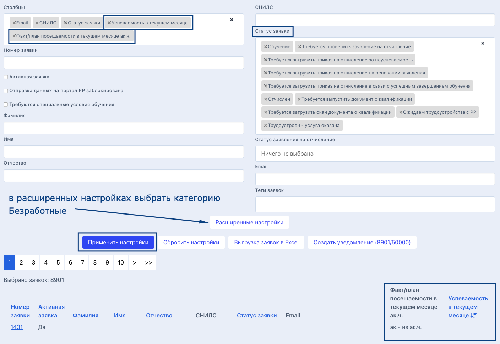

# Страница заявки

### **Страница заявки разделена на 4 блока**

<figure><figcaption></figcaption></figure>

Заявка

### Информация о текущей  заявке гражданина

**Номер заявки**&#x20;

**Дата отправки данных на РР** - все заявки синхронизируется с порталом Работа России.

**Создано** - дата подачи заявки гражданином&#x20;

**Одобрена ЦЗН** - дата одобрения заявки в  ЦЗН

**Первый и последний на текущий момент вход гражданина в свой личный кабинет**

**Образовательный партнёр** - образовательная организация, куда была подана заявка

**Подразделение** - название подразделения в системе Odin, в котором проводится образовательная программа.

**Наименование программы**  образовательная  программа в системе Odin, на которую была подана заявка.  \
**Основной | Для безработных** -тип договора для данной программы

**Категория гражданина** - категория, по которой была подана заявка на участие.

Обучение

### **Обучение**

**Поток** - название потока в Odin

**Период обучения** - даты обучения на платформе Odin

**Список справок об успеваемости/посещаемости** - справки генерируются на основании данных из  Odin**.** Далее образовательная организация подписывает их и загружает подписанный скан.&#x20;

**Приказ на зачисление** - ссылка для скачивания приказа

**Приказ на отчисление** - ссылка для скачивания приказа

<strong>Личные данные</strong>

**Идентификатор гражданина**

**СНИЛС**

**ИНН**

**День рождения**

**Данные паспорта**

**Адрес регистрации**

**Почтовый адрес**

\_\_\_\_\_\_\_\_\_\_\_\_\_\_\_\_\_\_\_\_\_\_\_\_\_\_\_\_\_\_\_\_\_\_\_\_\_\_\_\_\_\_\_\_\_\_\_\_\_\_\_\_\_\_\_\_\_\_\_\_\_\_\_\_\_\_\_\_\_\_\_\_

**Образование**

**Данные диплома**

\_\_\_\_\_\_\_\_\_\_\_\_\_\_\_\_\_\_\_\_\_\_\_\_\_\_\_\_\_\_\_\_\_\_\_\_\_\_\_\_\_\_\_\_\_\_\_\_\_\_\_\_\_\_\_\_\_\_\_\_\_\_\_\_\_\_\_\_\_\_\_\_\_

**Телефон**

**Дополнительный телефон**

**Email**

**Дополнительный email**

<strong>Сканы документов</strong>

### **Сканы документов**

**Первичные документы:**

Копия паспорта

Диплом/справка с места учебы/документ об образовании

Документы о смене фамилии (при наличии)&#x20;

**Документы об образовании:**

Заявление на зачисление

Договор

Согласие на обработку персональных данных

Согласие за изменение сроков обучения (при наличии)&#x20;

Заявление на отчисление (при наличии)&#x20;

Приказ на зачисление

Приказ об отчислении

**Документы об обучении и трудоустройстве**

Документ о квалификации

Документ о трудоустройстве

****




[statusy-zayavki.md](../rabota-s-zayavkami/statusy-zayavki.md)

